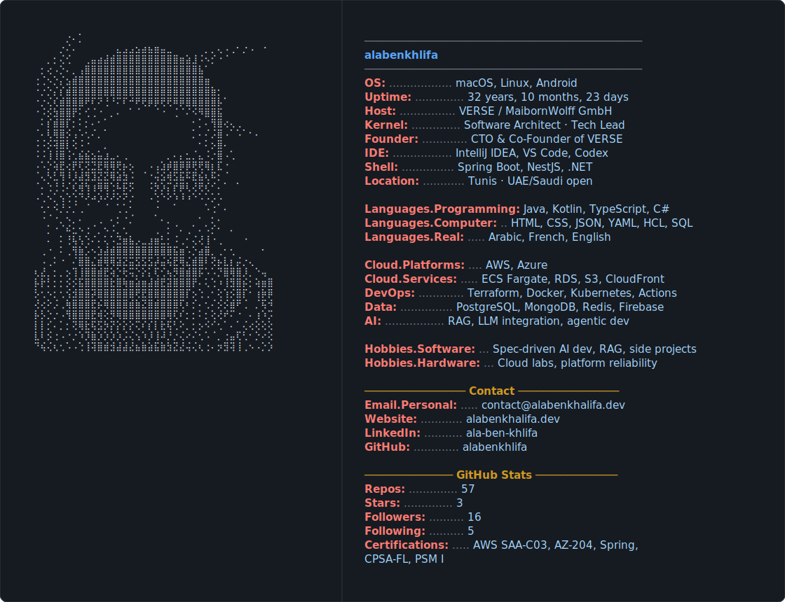

  

<h2>Profile Highlights</h2>

<ul>
  <li><strong>7+ years</strong> designing and scaling backend and cloud-native systems across AWS and Azure.</li>
  <li><strong>CTO & Co-Founder of VERSE</strong>, leading architecture, backend, cloud infrastructure, DevOps, and reliability.</li>
  <li><strong>4000+ users served</strong> through an AI-assisted agriculture mobile and web platform.</li>
  <li><strong>10+ microservices</strong> led across Spring Boot, Kotlin, AWS, Kubernetes, MQTT, and Firebase.</li>
  <li><strong>5 professional certifications</strong> across AWS, Azure, Spring, software architecture, and Scrum.</li>
</ul>

<h2>Certifications</h2>

<ul>
  <li><a href="https://www.credly.com/badges/a7b59cec-c36b-4f4c-8b83-c3c7049b29a4/public_url">AWS Solutions Architect - Associate (SAA-C03)</a></li>
  <li><a href="https://learn.microsoft.com/en-gb/users/alabenkhlifa-5063/credentials/9c8536062d8cb627">Microsoft Azure Developer Associate (AZ-204)</a></li>
  <li><a href="https://www.credly.com/badges/870f3004-4db1-4af0-80fa-2ea2a9c6f9bc/public_url">Spring Certified Professional 2024 v2</a></li>
  <li><a href="https://www.certible.com/badge/42b8de20-3d49-44f4-8290-488f81321502/">iSAQB Certified Professional for Software Architecture - Foundation Level (CPSA-FL)</a></li>
  <li><a href="https://www.credly.com/badges/8708e36f-ffb1-48f7-b33d-2325f55cb114">Professional Scrum Master I (PSM I)</a></li>
</ul>
